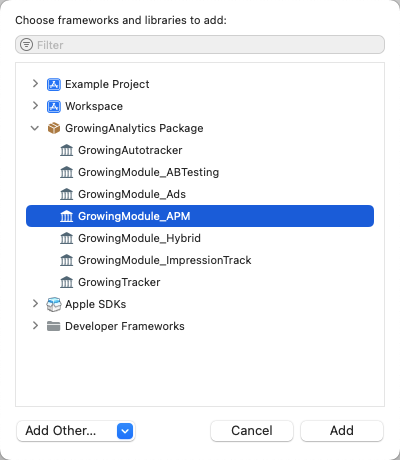

GrowingIO APM
======


### SDK 简介

**GrowingAPM** 提供移动端性能采集分析功能，包括崩溃分析、启动分析、页面加载分析等。


### Cocoapods 集成

#### 集成 APM

1. 集成 APM 模块

```
pod 'GrowingAnalytics/APM'
```

2. 集成 GrowingAPM

```
pod 'GrowingAPM'
```

打开终端，切换到项目目录，执行 `pod install` 或 `pod update`

#### 初始化 GrowingAPM

1. 在 main.m 中导入 `#import "GrowingAPMModule.h"`，并在 main 函数中添加代码：

```
int main(int argc, char * argv[]) {
    // GrowingAPM Setup
    [GrowingAPM setupMonitors];
    NSString * appDelegateClassName;
    @autoreleasepool {
        // Setup code that might create autoreleased objects goes here.
        appDelegateClassName = NSStringFromClass([AppDelegate class]);
    }
    return UIApplicationMain(argc, argv, nil, appDelegateClassName);
}
```

2. 在 AppDelegate.m 中导入 `#import "GrowingAPMModule.h"`，并在 `application:didFinishLaunchingWithOptions:` 中初始化 GrowingAnalytics SDK 的同时，导入 GrowingAPMConfig 配置:

```
GrowingAutotrackConfiguration *configuration = [GrowingAutotrackConfiguration configurationWithProjectId:@"YourAccountId"];
configuration.dataCollectionServerHost = @"YourServerHost";
configuration.dataSourceId = @"YourDatasourceId";

// 添加 GrowingAPM 初始化配置
GrowingAPMConfig *config = GrowingAPMConfig.config;
// 根据您需要的监控类型
config.monitors = GrowingAPMMonitorsCrash | GrowingAPMMonitorsUserInterface;
configuration.APMConfig = config;

[GrowingAutotracker startWithConfiguration:configuration launchOptions:launchOptions];
```

#### 其他

如您的 App 采用延迟初始化方式初始化 GrowingAnalytics SDK（即不在 `application:didFinishLaunchingWithOptions:`中初始化），则需要您在 `application:didFinishLaunchingWithOptions:` 中添加以下代码，以便 GrowingAPM 正确获取启动耗时：

```
[GrowingAPM didFinishLaunching];
```

另外，如果您仅需要部分 APM 监控功能，可按需集成对应的 GrowingAPM 子模块：

```
# GrowingAnalytics/APM 模块
pod 'GrowingAnalytics/APM'
# 按照所需 GrowingAPM 子模块自由组合
pod 'GrowingAPM/UIMonitor'
pod 'GrowingAPM/CrashMonitor'
# ...
```


### SwiftPM 集成

#### 集成 APM

添加 **GrowingModule_APM** Package



#### 初始化 GrowingAPM

1. 在 **main.swift** 中导入 `import GrowingModule_APM`，并添加以下代码：

```
GrowingAPM.setupMonitors()
```

2. 在 **AppDelegate.swift** 中导入 `import GrowingModule_APM`，并在 `application:didFinishLaunchingWithOptions:` 中初始化 GrowingAnalytics SDK 的同时，导入 GrowingAPMConfig 配置:

```
let config = GrowingAutotrackConfiguration(projectId: "YourAccountId")
config?.dataCollectionServerHost = "YourServerHost"
config?.dataSourceId = "YourDatasourceId"

// 添加 GrowingAPM 初始化配置
let apmconfig = GrowingAPMConfig()
// 根据您需要的监控类型
apmconfig.monitors = [.crash, .userInterface]
config?.apmConfig = apmconfig

GrowingAutotracker.start(with: config!, launchOptions: launchOptions ?? [:])
```

#### 其他

如您的 App 采用延迟初始化方式初始化 GrowingAnalytics SDK（即不在 `application:didFinishLaunchingWithOptions:`中初始化），则需要您在 `application:didFinishLaunchingWithOptions:` 中添加以下代码，以便 GrowingAPM 正确获取启动耗时：

```
GrowingAPM.didFinishLaunching()
```
